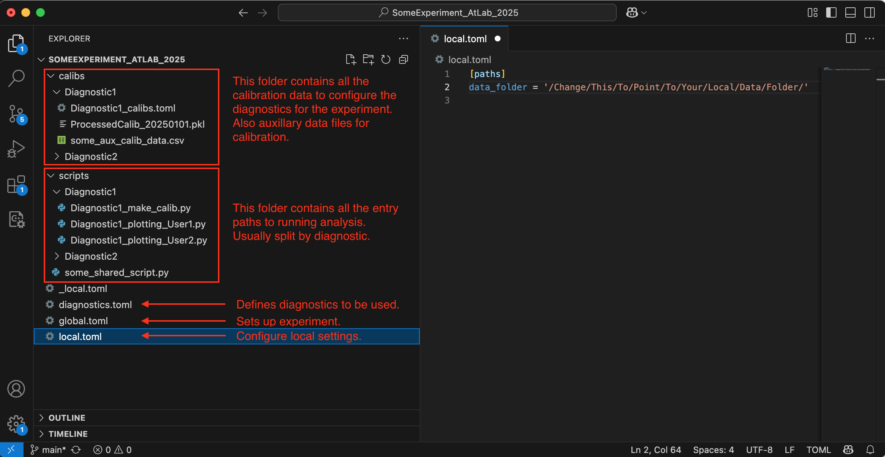
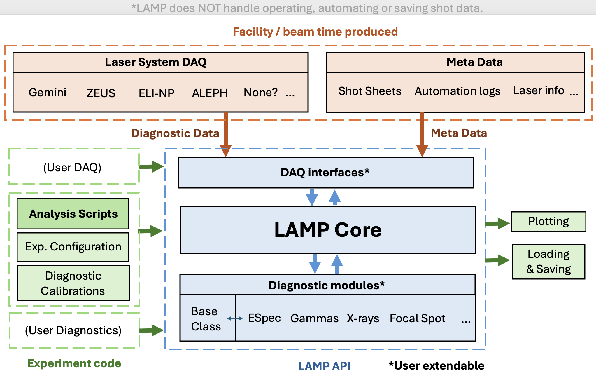

<!--- https://www.markdownguide.org/ --->

**L**aser-plasma **A**nalysis for **M**ultiple **P**latforms

# Documentation (in progress)

## Aim / Ethos
The main goal of LAMP is to provide a **framework for processing data from laser-plasma experiments** at different laser facilities. 
It enables access to reusable diagnostic code and scripts that can be quickly implemented (with a bit of know how). 
This works by using an **abstraction layer for accessing data**, with a different DAQ (Data Acquisition) module depending on the facility in question. 
All diagnostic analysis code works through this DAQ system, but also make use of **shared libaries and utlities for common processing steps** like background subtraction, spatial transforms, etc.
**Calibration input decks**, that are for the most part human readable/writable, are used to specify the unique properties of any diagnostics on any given experiment.
With the above in place, **short, simple and reusable scripts** are the entry way for analysing experimental data, calling on LAMP functionality where needs be.
This should **reduce the rewriting of code and streamline analysis**, allowing online experiment analysis, but also hopefully reduce workload, identify bugs, and make the working of diagnostics accessible.

It is not a means of taking data (such as a facility DAQ system) or a simulation tool.

## Using LAMP
Need to be clear, by using LAMP, you are agreeing to the collaboration terms.
Don’t put code into it, if you don’t want it shared with others.
LAMP has no responsibility for analysis outcomes.
It is “Open-access” rather than open source; requests for access will be accepeted if the user agrees to the memoranium of understanding.

## Table of contents
1. [Getting Started](#getting-started)
2. [Developing LAMP](#developing-lamp)
3. [Diagnostic Manuals](#diagnostic-manuals)
4. [DAQs](#DAQs)

#1. <a name="getting-started"></a> Getting Started

## Installation 

As LAMP is still currently under heavy development, it has not been packaged and so "installation" is currently a bit rough and ready.

My (BK) recommendation currently is to follow these steps:

- Download something like [GitHub desktop](https://desktop.github.com/download/) to manage the different experiment and LAMP repositories on your computer, and to push/pull updates. If you don't know how to use git, I would recommend googling some tutorials.
- Download a local copy of the experiment repository.
- Copy *_local.toml* to *local.toml* and edit the data folder path to point to your local copy.
- Download a local copy of the LAMP repository to INSIDE this experiment folder. If you are working on multiple experiments, it helps to create an alias for each LAMP copy.
- The figure below depicts an example folder layout for an experiment repository, with LAMP inside it.
- Make sure you push/pull all updates before and after working on the experiments or LAMP.

Note that currently I am not expecting anybody to setup an experiment repository, I (BK) can do that. Please ask if you need help with this.



Requirements (at least):

- numpy
- matplotlib
- scipy
- skimage
- toml
- opencv
- pandas
- ?

## An example script 

```
# -----------------------------------------------------------------------------
# import LAMP - this will be much easier when installable as a package
import sys, os
ROOT_FOLDER = os.path.dirname(__file__) + '/../../' # point this to the folder containing LAMP and/or the config files
sys.path.append(ROOT_FOLDER)
from LAMP import Experiment
# -----------------------------------------------------------------------------
import matplotlib.pyplot as plt 

# create experiment object
ex = Experiment(ROOT_FOLDER)

# get ESpec diagnostic object
eSpec = ex.get_diagnostic('eSpec')

# define a shot
shot_dict = {'date': 20250218, 'run': 'run05', 'shotnum': 40}

# plot
fig, ax = eSpec.plot_proc_shot(shot_dict, debug=True)
plt.tight_layout()
plt.show(block=True)
```

1. **Import LAMP** - this is a bit of a fudge at the minute, until we package up LAMP. 
2. **Setup the experiment object** by passing a path to the root anylsis folder (experiment repository clone). This reads the configuration files and initiates the framework.
3. **Get a diagnostic object.** This could also be a results object or meta information object. Each of these objects will have their own functionality, but interact with experiment data or processed information through LAMP subroutines, or the interfaces defined in the different DAQ modules.
4. **Define a shot dictionary**; these are key to how LAMP accesses data universally. Will also dictate the specific calibration used.
5. **Use an analysis function**. Here we are plotting a processed shot, with some debug info.


## Configuring diagnostics and experiment details:

### **diagnostics.toml** 
...

### **Calibrations** 
Key to setting up diagnostics. Like an input deck for the specific experiment setup. It is split into named blocks that indicate when the calibration should be applied. Some will have processed data in a seperate file, usually generated by a make_calib() function.

### **DAQs**
...

## Contributing
When you have made a (hopefully somewhat stable) update to your diagnostic code, push the changes.
For experiment scripts they will be part of an experiment repository update
For changes to the core workings of LAMP (i.e. diagnostic code), you will have to update the LAMP repository
For now, BK will have to accept these changes and merge them to the master version, but you can keep on developing on your side. (Not sure if this is still true?)
If multiple people are developing the same diagnostic code, we might want to have different modules, or co-ordinate the writing.
Please try to follow the structures/conventions in place with existing LAMP code. For more details see the development section.


## General overview of how LAMP works


	

## Starting a new experiment

(NOTE: This should already be done within an experiment repository, most people won't have to do this. If you need help, ask BK, but normally I have set all this up)

1.	Decide on your folder structure. Examples are (will be) given in /templates/.
2.	Create a config file. The minimum required information is the DAQ name (see list of DAQs later) in a setup section, and the path to the data folder in paths section.

```
[setup]
DAQ = GeminiMirage
[paths]
data_folder = /Some/Path/To/All/Experiment/Data/
```

3.	Add a diagnostic to the diagnostic config file. The minimum required information is the name, the diagnostic module (type), and the data folder (contained in the root data folder).

```
[setup]
name = ESpecHigh
type = ESpec
data_folder = ./ESpec/
```

4.	Create a script. This will start by initiating the experiment using a root folder which points to LAMP, and passing an experiment config file.

#2. <a name="developing-lamp"></a> Developing LAMP 

## General guidelines
- For functions in the DAQ / Diagnostic layers, try to keep named arguments? 
- Keep specific actions as separate subfunctions as to future proof the code or centralise changes in structure / formatting.

For writing diagnostics, alongside data access, LAMP has routines for;
Image transformation
Background correction
ROI definitions
Montage plotting
Etc.


## Writing a new diagnostic

Where it makes sense, have functions following this nonclemature:

- get\_proc\_shot(shot_dict)
- make\_calib()
- ...

Make use of common / shared functions such as:

- run\_img\_calib() ... more info on this...
- ...

Calibration statements that are autoprocessed by the above function:

+table+

Should interface to the DAQ through the following functions:

- get_shot_data(diagnostic_name, shot_dictionary)
- get_shot_info?
- Use calibraation framework
- Calibration outputs should be saved as .pkl files where it is large data (arrays or images)

Debug flags; Important for showing inner workings of processing. All functions should have an optional parameter to turn on plotting / output for tracking what has been done, finding problems.


## Writing a new DAQ interface

Required function calls
- get_shot_data(diagnostic_name, shot_dictionary)
- get_shot_info?
- timeline?

## Writing a new Meta interface
...


<hr/>

#3. <a name="diagnostic-manuals"></a> Diagnostic Manuals

Some intro note here, but the "second half" of this documentation should focus on the details of using each diagnostic.

Student learning? Realistically you still won’t be able to use the code without knowing how the diagnostic works; LAMP’s goal is to remove the bulk of the coding work for analysis. Good documentation will aide in understanding & learning. If somebody has a primary goal of developing a diagnostic then they can dig deeper.


## ESpec

### Description
Including diagrams

### References

- General
	-  
- Charge calibration
	- G. Boutoux et al. Rev. Sci. Instrum. 86, 113304 (2015) [https://doi.org/10.1063/1.4936141](https://doi.org/10.1063/1.4936141)
	- Maddox?
- Advanced


### Key Functions

Along with internal functions (that can be used if needed), here is a list of common user callable functions:

`get_proc_shot(shot_dict, ...) / plot_proc_shot(shot_dict, ...)`

**Returns:** *img, x, y* 

Where...

`get_spectrum() / get_spectra() / plot_spectrum()`

`get_spectrum_metrics() and get_spectra_metrics()`

`get_charge()`

`montage()`

### Calibration inputs

dispersion
divergence


## XAS

...

#4. <a name="DAQs"></a> DAQs

## Gemini Mirage

Requirements:

- sqlite3

