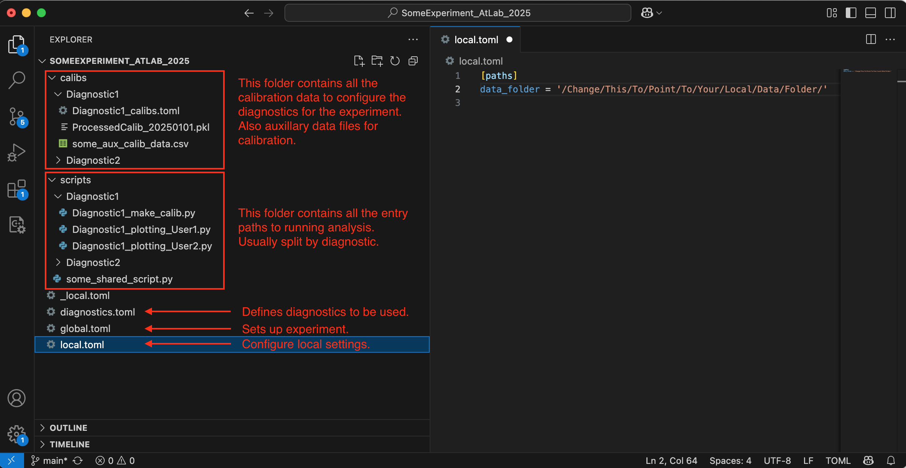
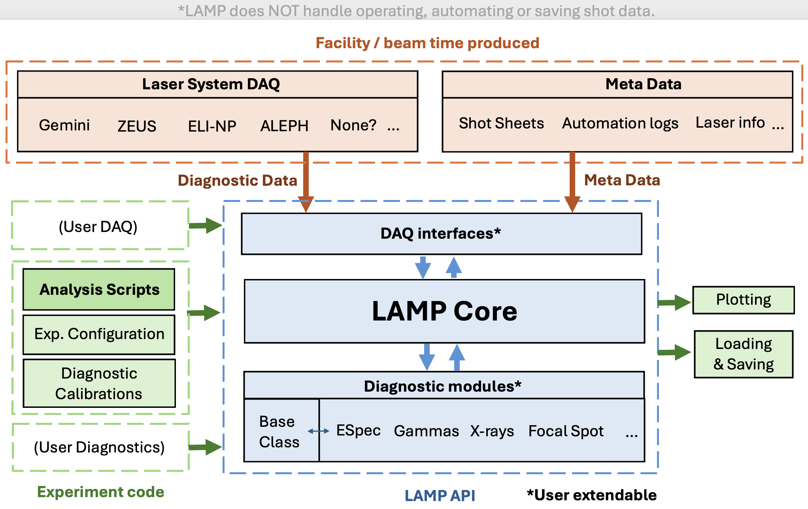

<!--- https://www.markdownguide.org/ --->

**L**aser-plasma **A**nalysis for **M**ultiple **P**latforms

# User Guide

## Aim / Ethos
LAMP is a python API designed to provide a **framework for processing and analysing data from laser-plasma experiments**, from different laser facilities. 
It enables access to reusable diagnostic code and scripts that can be quickly implemented. 
It uses **abstraction layers for accessing data**, with a different layer (known as a **DAQ module**) for each specific facility. 
All analysis code works through **diagnostic modules**, which in turn use this DAQ system, but also use **shared libaries and utlities for common processing steps** like background subtraction, spatial transforms, etc.
The unique properties of any diagnostics on any given experiment are set using **calibration input decks**, that are for the most part human readable/writable.
With the above in place, **short, simple and reusable scripts** are the entry way for analysing experimental data, calling on LAMP functionality where needs be.
This should **reduce the rewriting of code and streamline analysis**, allowing online experiment analysis, but also reduced workload, bug identification, as well as making the workings of diagnostics accessible.

It is NOT a means of taking data (such as a facility DAQ system) or a simulation tool.

## Table of contents
1. [Getting Started](#getting-started)
2. [Building upon LAMP](#building-upon-lamp)
3. [Useful Utilities](#useful-utilities)
4. [Troubleshooting](#troubleshooting)
5. [Diagnostic Manuals](#diagnostic-manuals)
6. [DAQ Manuals](#DAQs)

<a name="getting-started"></a>
# 1. Getting Started

## Installation

```
pip install lamp
```

Requirements (at least), more unconventional package ares highlighted:

- scipy
- skimage
- pandas
- **toml**
- **opencv**

## Setting up an experiment

The LAMP API assumes a an existing folder structure and a few configuration files. You will need to create at least the files listed below. 

Alternatively, you may be part of a collaboration where somebody has already created a repository with the required folders/files already set up, for example on github. If so, after cloning the repository, you will only need to create the local.toml file (see below). Then you can continue to the example script section.

Note that most of the configuration or calibration inputs file make use of **TOML (Tom's Obvious Minimal Language)**. I would recommend having a quick look at the website if you are unfamiliar - [https://toml.io/en/](https://toml.io/en/) - it is fairly straightforward. 

### **global.toml** 
This file contains experiment settings common for everybody collaborating on the analysis. 
Currently, the global file usually specifys which DAQ module to use, and any extra DAQ settings, as well as some relative filepaths, for things like the calibrations parent folder.
This file should only need edited upon the creation of an experiment. An example is given below.

```
[setup]
DAQ = 'GeminiMirage' # GeminiMirage, Apollo, etc. If it is a filename with an extension, it assumed to be user defined

[DAQ_config]
shotnum_zfill = 0
eCat_file = '../eCat_export.csv' # from root data folder?
#mirage_sql = '' # default is data.sqlite
#automation_logs = '' 

[paths]
calibs_folder = './calibs/' 
results_folder = './results/'
user_diagnostics = 'diagnostics.' # this is as per python moadule loading. So '.' to represent folders
#user_DAQs = 'DAQs.'  # also as per python moadule loading. 
```

### **local.toml** 

This file contains user specific settings, such as the file path for locally stored data. An example is given below.

```
[paths]
data_folder = '/absolute/path/to/data/'
```

Note, if your analysis is part of a collaborative github repository, the file *_local.toml* may already be present, which you can rename to *local.toml* and edit. In that case, make sure *local.toml* is listed in the *.gitignore* file in the root directory.

### **diagnostics.toml** 
This file contains a list of each of the diagnostics to load for the experiment. 
Each section should be labelled with the diagnostic name, and contain a set list of configuration parameters. 
Edit this if you want to add a new diagnostic to the experiment. 
An example, with explanations for the various configuration values, is given below. 
These configuration values are constant throughout the entire experiment being analysed, and are mostly to do with how the diagnostic is saving. 
Not calibration values that might change (for which, see below).

```
[eSpecHigh]
type = 'ESpec' # either included LAMP module, or user defined
data_folder = '/eSpec/' # sub folder from root data path
data_stem = 'ESpec_' # empty for some DAQs 
data_ext = 'tif'
calib_subfolder = './eSpecs/' # optional subfolder for calibrations
calib_file = 'eSpec_calibs.toml' # required calibration file, even it is a 'dummy'

[Betatron]
type = 'XrayFilterArray'
data_folder = '/Betatron/' 
data_stem = 'OnAxis_' 
data_ext = 'tif'
calib_subfolder = './Betatron/' # optional
calib_file = 'Betatron_calibs.toml'
```

### **Calibration files** 
The calibration files you define are key to setting up a diagnostic with the specific details for the experiment (and which can change throughout said experiment). 
They are like an input deck for the diagnostic.
For example, geometry distances, CCD settings, filter thicknesses, etc.
Each diagnostic will have one calibration file, containing a list of seperate cases where the configuration has changed. 
Each configuration case will have its own named block with a unique ID, containing seperate calibration details.
Each case must define the timeframe within which the specific calibration should be applied.
To do so, you provide the start and end shot dictionaries (see shot dictionary explanation below) covering said timeframe.
Think of it as a history list of when the diagnostic is altered throughout an experiment, each block being a specific setup.
An example is given below.

```
[some_unique_calibration_id]
	notes = 'Some notes about this specific configuration. E.g. when we moved the CCD from X to Y'
	proc_file = 'OutPutFileName.pkl' # optional; if making processed calibrations
	start = {date = 20240101, run = 'run01', shot = 0} # when timeframe starts
	end = {date = 20240102, run = 'run10', shot = 0} # when timeframe ends
	
	[some_subset_of_settings] # these will be diagnostic specific
	pixel_X = 100
	pixel_Y = 200
	pixel_Z = 300
	
[some_other_calibration_id]
	# note the difference in dates/runs; continuing from above
	start = {date = 20240102, run = 'run11', shot = 0} # when timeframe starts
	end = {date = 20240131, run = 'run99', shot = 0} # when timeframe ends
	
	# but this time, the settings are different...
	[some_subset_of_settings] 
	pixel_X = 500
	pixel_Y = 600
	pixel_Z = 700
```

Note that some diagnostics will require processing calibration inputs into a processed binary file (the filepath given by *proc\_file*), to help speed up analysis and avoid repeating processing routines.
For example the transformation details for warping a screen may be provided in the calibration, but the processed file will contain the information requried to do the warping, without recalculating it each time.
These are usually generated by a make_calib() function.


### An example file / folder setup

The figure below depicts an example folder layout for an experiment repository.



For experiment collaboration, a github (or similiar) repository is recommended.
- [GitHub desktop](https://desktop.github.com/download/) can manage the different experiment repositories on your computer, and push/pull updates. Many git tutorials are available online.
- Download a local copy of the experiment repository.
- Copy *_local.toml* to *local.toml* and edit the data folder path to point to your local copy.


## An example script 

Below describes a common workflow for looking at some processed data. It is for an electron spectrometer, but the same general format applies to many diagnostics. 

```
from pathlib import Path
import matplotlib.pyplot as plt 

# 1. import the Experiment object from LAMP 
from LAMP import Experiment

# 2. create experiment object, passing the root folder path
ROOT_FOLDER = Path(__file__).resolve().parents[1] # absolute path to the experiment config files and other subfolders; 2 directories up in this case (assuming script in in ./scripts/eSpec/script.py)
ex = Experiment(ROOT_FOLDER)

# 3. get ESpec diagnostic object
eSpec = ex.get_diagnostic('eSpec')

# 4. define a shot
shot_dict = {'date': 20250218, 'run': 'run05', 'shotnum': 40}

# 5. plot some processed data
fig, ax = eSpec.plot_proc_shot(shot_dict, debug=True)
plt.tight_layout()
plt.show(block=True)
```

1. **Import LAMP**
2. **Setup the experiment object** by passing a path to the root of the analysis folder (containing the configuration and calibration files detailed above). This reads the configuration files and initiates the framework.
3. **Get a diagnostic object.** This could also be a results object or meta information object. Each of these objects will have their own functionality, but interact with experiment data or processed information through LAMP subroutines, or the interfaces defined in the different DAQ modules.
4. **Define a shot dictionary**; these are **key to how LAMP accesses data universally**. It is how you point the API to specific shot data. It will also dictate the specific calibration used by the diagnostic. It should be in the form of date, run, (burst?), shot, but might be DAQ specific.
5. **Use an analysis function**. Here we are plotting a processed shot, with some debug info. Each diagnostic will have a range of functions. See the user guide or example scripts for each.


<a name="building-upon-lamp"></a> 
# 2. Building upon LAMP 

## General overview of how LAMP works

Below is a pictorial description of how the LAMP API functions. 
The user entry point is through the analysis scripts, assuming the associated experiment and diagnostic settings have been defined. 
The LAMP API pulls data (or meta data or results) using DAQ (Meta/Results) abstraction layers.
It uses predefined utilities or diagnostic functions to return information or plots to the user.
These diagnostic modules (or DAQs) can be further extended by the users for new or specific techniques.


	

## Adding your own diagnostic

It is very possible to make your own "user-defined" diagnostic (outside of those written and pre-defined by the LAMP code).
In fact, if you are working on developing a set piece of analysis for a certain diagnostic, you will probably wish to do this, even if it is just extending the functionality of an existing diagnostic, or making it more specific to a certain experiment.
To do so, make sure you have a *user_diagnostics* entry in the global.toml configuration file, under the *paths* subsection.
This points to the folder containing the diagnostic module you have written.
Note, the contents of the config entry is taken in the import module command, so periods instead of slashes for folders.
For example if you have created a folder *./diagnostics/* containing your diagnostic module files, then the global.toml entry would be as follows:

```
[paths]
user_diagnostics = 'diagnostics.'
```

Any user diagnostics should really extend the base diagnostic class, and a template is given below;

```
from LAMP.diagnostic import Diagnostic 

class NewDiagnosticName(Diagnostic):

	data_type = 'image'

	# Initiate parent base Diagnostic class to get all shared attributes and functions
	# the experiment object and config filepath are passed upon initilisation, to set the calibration data etc.
	def __init__(self, exp_obj, config_filepath):
        super().__init__(exp_obj, config_filepath)
        return
        
   def some_new_functionality(self):
   
  		return
  		
  	...

```

Or even extent an existing diagnostic, by replacing `class NewDiagnosticName(Diagnostic):` in the above with `class NewDiagnosticName(DiagnosticName):`.

Where possible, diagnostics should interface to the DAQ through the following functions:

- `self.get_shot_data(shot_dictionary)` for raw data
- `self.get_proc_shot(shot_dictionary)` for processed data (calibrations applied)

They should also use the **calibration framework**, for example getting calibration values via `self.calib_dict['__SETTING_NAME__']`, which is automatically loaded through the base diagnostic class, to allow settings to be changed via the specified calibration input deck.
As well as functions like `load_calib_file(filename,)` for getting additional external calibration data, or the `make_calib()` function for generating processed calibration files (where possible).

For more help, the best approach is probably to look at the code for another diagnostic and use it as a template. 

### Some recommendations

Make use of base functions such as `self.get_proc_shot()` or `self.run_img_calib()`, which return **pre-processed data**.
Any blocks present in the calibration statements that are autoprocessed by these functions include:

* background correction (and secondary correction)
* dark correction
* spatial transforms (including simple rotation, or scaling)
* median and blob filtering
* regions of interest (ROI)

There is also for example, the `montage()` function to help with plotting.
In general, have a look at existing diagnostic code in the source, to see how things operate or shortcuts you can use.

**Debug flags**

Important for showing inner workings of processing. All functions should have an optional parameter to turn on plotting / output for tracking what has been done, finding problems.


## Adding a new DAQ interface

You can also add your own user defined DAQ module. 
This section of the guide needs to be update, but for now, I would recommend looking at the existing modules.
They can be extended much like the user extendable diagnostics.

Note there are some required function calls:

- `get_shot_data(diagnostic_name, shot_dictionary)`
- `get_filepath(diag_name, shot_dict)`
- `build_time_point(shot_dict)`

And some desriable fucntions:

- `get_shot_info(shot_dict)`
- `get_shot_dicts(diag_name, timeframe)`

<hr/>

<a name="useful-utilities"></a>
# 3. Useful Utilities

Any scripts or diagnostics can always call the pre-written utility functions packaged with LAMP. Some useful utiliies include:

- Image processing (see `run_img_calib()` details above)
- Results saving / loading
- File IO functions
- X-ray filter transmission
- Plotting helper functions (i.e. montaging)
- General wrapper routines or functions (i.e. smoothing)

A full API reference will come in due course, but for now I will detail some of the more useful capabilities below.

## Background correction

When the `background` sub-block is defined in a calibration, the `run_img_calib()` will trigger the automatic processing of a background correction to the image. There are a few options for this detailed below.

- **stage**: When to perform the correction. Options are currently "original" or "transformed". 
- **type**: What correction routine to use. Options currently are;
	* "flat": assume average mean from ROI to subtract across all whole image.
	* "gradient": take average across a single axis of ROI, then replicate this across the other axis.
	* "surface": fit a surface to LIST of ROIs. Currently a polynominal fit, but in future this will be more configurable.
- **roi**: Region of interest to take the background sample for interpolating across the rest of the image. Note, ROIs take the form of a nest list; `[[x1,y1],[x2,y2]]`.
- **axis**: (for use with "gradient" type) the direction to average across; "horizontal" or "vertical".
- **order**: (for use with "gradient" or "surface" type) the polynominal order for the fitting. Default is 4?

Note, you can also perform a secondary background correction using a `background2` sub-block.

Examples:

```
    [20250306.background]
    stage = 'original'
    type = 'surface' 
    roi =  [[[10,10],[550,200]],
            [[850,10],[2040,200]],
            [[10,800],[550,1010]],
            [[850,800],[2040,1010]]]
    order = 2
```

or

```
    [20250306.background]
    stage = 'transformed' # do after rotation (defined elsewhere)
    type = 'gradient'
    axis = 'horizontal'
    roi = [[10,10],[2040,100]]
```

## Saving/loading results

Sometimes it is useful to save some output for future plotting, reloading into scripts, or passing on to other people working on the analysis. 
To facilitate this LAMP provides a *"results database"* functionality, which is its own method of saving data (to a pickle file, in the form of a Pandas dataframe), with some extra information tagged along with it (and to wrap the code to make it easier to use).

To create a results database or load an existing set;
```
res = ex.open_results('__DB_NAME__')
```

You can have a quick look to see what is stored in the database using;
```
print(res.contents())
```

Or see which unqiue shots have associated values in the database;
```
print(res.shots())
```

To store something in the database, you can do for example;

```
res.add('__VARIABLE__NAME__', some_variable, shot_dict=shot_dict, description='Some details on what', user='__USERNAME__')
```

And to get some stored information;
```
value = res.get(self, '__VARIABLE__NAME__', shot_dict=shot_dict)
```

If you want all the tagged information as well, set the *info* flag to true;
```
value, description, details, user, script, timestamp = res.get(self, '__VARIABLE__NAME__', info=True)
```

You can delete an entry using;
```
res.delete('__VARIABLE__NAME__', shot_dict=None)
```

There is some other options and functionality that can be explored in the *results.py* module. For instance you can skip saving the file each time you add data (*save=False* in *.add()*), and save the database at a later point (using *.save()*), to save script time.

Note you can access any of the usual Pandas dataframe functionality by accessing the res.db object.


<a name="troubleshooting"></a> 
# 4. Troubleshooting

While loading a pickle file:

```
ModuleNotFoundError: No module named 'numpy._core.numeric'
```

The pickle file was saved using a later version. You probably need to update python or get the file resaved? (remake a calibration?).

<a name="diagnostic-manuals"></a> 
# 5. Diagnostic Manuals

The following portion of this documentation will focus on the specific details of using each diagnostic.
Please keep the following in mind.
Student learning - realistically you still won’t be able to use the code without knowing how the diagnostic works; LAMP’s goal is to remove the bulk of the coding work for analysis. Good documentation will aide in understanding & learning. If somebody has a primary goal of developing a diagnostic then they can dig deeper.

## 5.1 Electron Spectrometer (ESpec)

### Description
To Do... Including diagrams

### References

- General
	-  
- Charge calibration
	- G. Boutoux et al. Rev. Sci. Instrum. 86, 113304 (2015) [https://doi.org/10.1063/1.4936141](https://doi.org/10.1063/1.4936141)
	- Maddox?
- Advanced


### Key Functions

Along with internal functions (that can be used if needed), here is a list of common user callable functions:

`get_proc_shot(shot_dict, ...) / plot_proc_shot(shot_dict, ...)`

**Returns:** *img, x, y* 

Where...

`get_spectrum() / get_spectra() / plot_spectrum()`

`get_spectrum_metrics() and get_spectra_metrics()`

`get_charge()`

`montage()`

### Calibration inputs

- dispersion
- divergence


